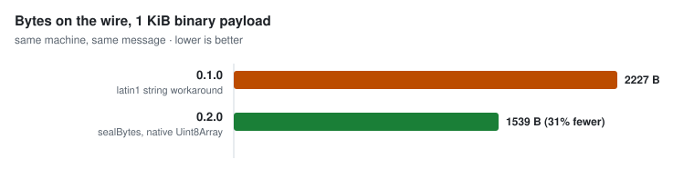

# ratchet-ts

[](https://github.com/gntrs/ratchet-ts/actions/workflows/ci.yml)
[](https://www.npmjs.com/package/ratchet-ts)
[](./LICENSE)
[](./src/index.ts)
[](https://www.npmjs.com/package/ratchet-ts)

Hybrid X25519 + ML-KEM-768 Double Ratchet in TypeScript. MIT.

> **Not audited.** No independent audit, no formal verification. The primitives
> (X25519, ML-KEM-768, HKDF-SHA256, HMAC-SHA256, XChaCha20-Poly1305) come from the
> audited [`@noble`](https://github.com/paulmillr) libraries. The protocol on top
> of them was written and reviewed by one person. There can be state-machine bugs
> no test catches. If real people's safety depends on it, use
> [libsignal](https://github.com/signalapp/libsignal) or fund an audit of this.
> Fine for learning, prototyping, internal tools, and anywhere MIT is a hard
> requirement and you can accept the gap. On 0.x the wire format and API can move.

> **This README is a lab notebook, on purpose.** It logs the whole process, not
> just the result: the method behind every number, the numbers that turned out
> to be wrong, and how each one was caught. A benchmark that measured a dead
> base64 path for months, an 11x speedup that was really 1.4x, a machine chart
> that overstated one row by 4x, all of it stays in, because the correction is
> the more useful half. That makes it long. It is meant to be long right now and
> it will be cut down to a short reference once the numbers stop moving.
> [CHANGELOG.md](./CHANGELOG.md) is the terse view: what changed, what the new
> number is, nothing else.
>
> Every latency claim below carries the machine, the runtime, the backend state,
> the payload size and whether it is a p50, a p99 or a median of runs. There is
> no p50 anywhere without its p99 next to it. **The canonical payload is 256
> bytes**, which is this project's working estimate of a real chat message. It
> is a choice rather than a discovery, and it barely matters: latency is flat
> below about 1 kB, and moving the payload from 200 B to 256 B moved the seal by
> less than the run-to-run noise (see the sweep below).

## Why

`libsignal` is the reference, and it is AGPL/GPL, so you cannot use it inside a
closed-source product. The usual next move is to write your own ratchet, which is
how most E2EE breaks.

This is the third option: MIT, post-quantum, and small enough to read before you
trust it.

| Library | License | Post-quantum | Language |
| --- | --- | --- | --- |
| [libsignal](https://github.com/signalapp/libsignal) | AGPL-3.0 | Yes, PQXDH | Rust + bindings |
| [libsignal-protocol-typescript](https://github.com/privacyresearchgroup/libsignal-protocol-typescript) | GPL-3.0 | No | TypeScript |
| [Olm / vodozemac](https://github.com/matrix-org/vodozemac) | Apache-2.0 | No | C++ / Rust |
| **ratchet-ts** | **MIT** | **Yes, ML-KEM-768 hybrid** | **TypeScript** |

Licenses confirmed against each repo on 2026-07-23. The `ratchet-ts` row is
verifiable here: license in [LICENSE](./LICENSE), the ML-KEM-768 handshake in
[`src/handshake.ts`](./src/handshake.ts).

## Install

```sh
npm install ratchet-ts
```

Runtime deps, all MIT: `@noble/curves`, `@noble/ciphers`, `@noble/hashes`,
`@noble/post-quantum`.

## Send a file between two machines

The package ships a `ratchet` command. Two machines, two commands, no account
and no setup. Install it on both:

```sh
npm install -g ratchet-ts
```

Note the `-g`. A plain `npm install ratchet-ts` puts the binary in
`node_modules/.bin` and it never reaches your PATH, so `ratchet` comes back as
command not found.

**On the machine receiving the file**, start the listener first:

```sh
ratchet recv --out . --once
```

`--out` takes a real path and does no expansion of its own, so `~/Downloads` is
fine in bash and zsh, where the shell expands it first, and creates a folder
literally named `~` in PowerShell and cmd, where nothing does. On Windows write
it out: `--out $HOME\Downloads` in PowerShell, `--out %USERPROFILE%\Downloads` in
cmd. The banner prints the directory it resolved to, so read that line before you
go looking for the file.

It prints every address it can be reached on, each one already written out as
the command to run on the other machine, with `FILE` where your filename goes.
**On the machine sending**, run that line with the name filled in:

```sh
ratchet send holiday.jpg --to 192.168.1.24 --stats
```

`--stats` is optional and prints the size, the time and the overhead afterwards.

Text works the same way, and a dash reads stdin so a pipe works:

```sh
ratchet send --text "the wifi password is hunter2" --to 192.168.1.24
echo "same thing from a pipe" | ratchet send - --to 192.168.1.24
```

### Moving a .env

This is the case that probably brought you here. A colleague needs the dev
`.env`, or your other laptop does, and the options are Slack, a ticket, or a
password manager that then keeps a copy of it forever.

```sh
# them, first
ratchet recv --out . --once

# you, with the address it printed
ratchet send .env --to 192.168.1.24
```

The bytes go straight from your machine to theirs over TCP. Nothing is uploaded,
nothing is stored, and when both processes exit there is no copy anywhere except
the two disks that were always going to have one.

`ratchet` notices when a transferred file looks like a secret: `.env`, `*.pem`,
`*.key`, `id_ed25519`, anything with `secret` or `credential` in the name. It
never prompts and never refuses, it just says it saw. The warning prints **on the
receiving machine**, after the file is written, and what it says is that the
transfer was encrypted and the file now sitting on that disk is not. The sending
side prints nothing extra. With `--json` the receiver's object carries
`"secret": true` for the same files.

### Talking instead of transferring

`ratchet chat` is the same handshake with a line-oriented terminal on top.
Nothing is written to disk at either end.

```sh
# one side
ratchet chat --port 4477

# the other, with the address the first one printed
ratchet chat --to 192.168.1.24:4477
```

Type a line, press enter, it arrives. `/quit`, Ctrl-C or Ctrl-D ends it and both
sides print how many messages moved. The same six safety words appear, and the
same rule applies: compare them out loud.

A chat only pairs with another chat. Both ends open with an invite and settle
the tiebreak between themselves, so `ratchet chat` will not talk to
`ratchet recv`, and it does not accept a file.

If you would rather install nothing, `npx ratchet-ts recv` and
`npx ratchet-ts send ...` do the same job. Spell out `ratchet-ts`: `npx ratchet`
is an unrelated package by somebody else.

The file contents and the metadata around them (the filename, the size, the
hash) are all encrypted with the same ratchet the library exposes. It is a
direct TCP connection between the two machines: no relay, no server, no account,
nothing of yours in the middle.

Both ends print two lines of six safety words the moment the handshake lands,
before the bytes finish moving.

```
  compare aloud  scan  fiber  black  abstract  cradle  struggle
  peer identity  derive  remain  trip  noise  bean  fix
```

**Compare the `compare aloud` line out of band**, out loud or over a channel an
attacker on this network does not control. That line belongs to the pair, so it
reads the same on both screens, and matching words mean you are talking to the
machine you think you are. Nobody checks this for you.

The `peer identity` line names the **other** machine, so the two screens show
different words there, and that is correct. It is the same six words that machine
prints for itself under `ratchet id`, and the same words the receiver shows in
the `you` line of its own banner. That is the cross-check: the sender's
`peer identity` should read back the receiver's `you` line. Do not expect it to
match your own words. If it ever does, you have connected to yourself.

Add `--stats` for the full measurement table, `--json` to pipe the numbers into
something else, and `ratchet id` to see this machine's own words.

### What a transfer costs

Two measurements, because they answer different questions. Loopback tells you
what the library costs. A real link tells you what a person waits.

**Loopback**, 10.5 MB file, two real `ratchet send` and `ratchet recv`
processes on one machine, AMD Ryzen 5 7530U, Node v25.8.0, Windows 11, all
three backends native. Published 0.3.2 installed from its tarball against
0.3.4, arms interleaved inside each repeat, wire bytes and payload SHA-256
identical across every run:

| | 0.3.2 | 0.3.4 |
|---|---|---|
| sender throughput | 56.48 MB/s | 79.98 MB/s |
| receiver throughput | 50.31 MB/s | 69.22 MB/s |
| wire overhead, 65519 B chunks | 0.2% | 0.2% |

The gain is roughly 1.4x and it is the native curve and hash backends plus the
copy removal in 0.3.3. It is not the 11x you get by comparing against the
figure this project published for 0.3.1 and 0.3.2, because that figure came
from a benchmark measuring a code path the CLI stopped using in 0.3.1. That is
written up in [bench/README.md](./bench/README.md), which opens by saying so.

The byte rows are exact rather than measured. Every chunk pays a constant 122
bytes of envelope whatever it carries, so a 10.5 MB transfer in 65519 byte
chunks pays 0.19% for the envelopes and the rest of the 0.2% is the handshake
and the framing. Both sides print the SHA-256 of what they hashed, and that is
the line worth checking before you trust any of the others.

**A real link**, a 763.5 kB file, a Windows laptop and a Linux box on a mesh VPN
that was relaying through a public relay instead of going direct. Close to the
worst realistic path: every packet crosses the internet twice. Older versions,
and not re-run since:

| | 0.2.1 | 0.3.0 | delta |
|---|---|---|---|
| on the wire | 1.0 MB | 765.3 kB | 25.0% fewer bytes |
| overhead | 257.0 kB (33.7%) | 1.8 kB (0.2%) | the base64 is gone |
| crypto | 52 ms | 47 ms | |
| wall time | 255 ms | 213 ms | 16.5% faster |
| throughput | 3.00 MB/s | 3.58 MB/s | 19.3% faster |

The hash matched on both sides both times, so that is the same file arriving
intact rather than a faster route to a different answer.

Read the two tables differently. The byte rows are exact and reproduce to the
byte against the published tarballs. The loopback rows are medians of
interleaved repeats on an idle machine. The real link rows are one run each, so
16.5% is the right order of magnitude and not a number to quote to three digits.

The prediction for 0.3.1 on that link was that it changes CPU only, so on a
3 MB/s relay it would move the `crypto` row and very little else. That has now
been tried, and the first sample did not behave that way: it came back at
0.60 MB/s against 3.58 for 0.3.0. The handshake column moved 38 percent across
the same set of samples, and that code is identical in both versions, so the
link was moving too and one run each settles nothing. It is written up honestly,
including the second explanation that would be more interesting than noise, in
[the two machine appendix](./bench/README.md#appendix-two-machines-one-relayed-link).
Until that A/B is run properly, treat 0.3.1 and 0.3.2 over a real relay as
unmeasured rather than as fast.

The speed gain is smaller than the byte saving because the handshake is a fixed
round trip that no amount of wire efficiency touches. Over a fast link this
library is the bottleneck. Over a slow one it is a fifth of the wait and the
rest belongs to the network.

### 0.3.0 to 0.3.1

Same bytes on the wire, about three times faster. Both versions installed from
their published tarballs, 763.5 kB file, loopback, AMD Ryzen 5 7530U, Node 25,
Windows 11, medians of 21 transfers. Kept here because it is the release that
moved, not because it is the current number: 0.3.4 on this machine does 79.98
MB/s sending, on a larger file, in the table above.

| | 0.3.0 | 0.3.1 | |
|---|---|---|---|
| sender wall | 56.5 ms | 18.7 ms | 3.0x |
| receiver wall | 60.8 ms | 22.5 ms | 2.7x |
| sender throughput | 13.5 MB/s | 40.9 MB/s | |
| handshake | 45.8 ms | 45.8 ms | untouched |
| bytes on the wire | 765,286 | 765,286 | identical |

0.3.0 base64ed every frame into an `OCX1.` token and parsed it straight back out
before the bytes reached the socket, twice per frame per direction, for a socket
where nothing was ever going to be pasted anywhere. 0.3.1 seals plaintext
directly to envelope bytes. The wire did not move, which is why a 0.3.0 peer and
a 0.3.1 peer still talk to each other: every frame was hashed under a seeded RNG
in both directions and came out identical.

Upgrading one end gets you part of it, 49.9 ms sending to a 0.3.0 peer against
56.9 ms between two of them, because work removed from one process shortens the
other's blocking reads. Upgrading both gets you all of it.

## Quickstart

This is the exact code the smoke test runs against the packed tarball, so it is
proven end to end.

```ts
import assert from 'node:assert/strict';
import { engine, formatFingerprint } from 'ratchet-ts';

const alice = await engine.createIdentity();
const bob = await engine.createIdentity();

// Alice invites, Bob accepts. Tokens are plain strings you can paste anywhere.
const { token: inviteToken, pending } = await engine.invite(alice);

const bobOpen = await engine.open(bob, inviteToken, {});
assert.equal(bobOpen.outcome, 'invite');
let bobSession = bobOpen.session;

const aliceOpen = await engine.open(alice, bobOpen.reply, { pending });
assert.equal(aliceOpen.outcome, 'accepted');
let aliceSession = aliceOpen.session;

// Both sides show the same 6-word fingerprint to verify out of band.
console.log('fingerprint:', formatFingerprint(bobOpen.peerFingerprint));

// Alice -> Bob
const a1 = await engine.seal(aliceSession, 'hello from alice');
aliceSession = a1.session;
const b1 = await engine.open(bob, a1.token, { session: bobSession });
assert.equal(b1.plaintext, 'hello from alice');
bobSession = b1.session;

// Bob -> Alice
const b2 = await engine.seal(bobSession, 'hi back from bob');
bobSession = b2.session;
const a2 = await engine.open(alice, b2.token, { session: aliceSession });
assert.equal(a2.plaintext, 'hi back from bob');
```

`seal` and `open` each return a fresh `session`. The ratchet is immutable at the
API boundary: keep the returned session, drop the old one, never reuse a session
across two `seal` calls.

Binary payloads go through `engine.sealBytes` and `engine.openBytes`: same
sessions, same wire format, `Uint8Array` in and out (files, images, protobuf).

```ts
// A PNG header, deliberately not valid UTF-8.
const bytes = new Uint8Array([0x89, 0x50, 0x4e, 0x47, 0xff, 0xfe, 0x00, 0xc0]);

const sent = await engine.sealBytes(aliceSession, bytes);
aliceSession = sent.session;

// Note the shape: openBytes takes the session directly, not an identity plus
// options. It only ever handles message tokens, so there is no handshake to
// dispatch on, unlike `open`.
const got = await engine.openBytes(bobSession, sent.token);
assert.deepEqual(got.plaintext, bytes);
bobSession = got.session;
```

Tokens interoperate across both APIs, because the string path is a UTF-8 view
over the byte path: a `seal` token opens under `openBytes` as its exact UTF-8
encoding, and a `sealBytes` token that happens to be valid UTF-8 opens under
`open`. One token carries at most 65519 bytes of plaintext; chunk anything
bigger yourself.

If your transport is already binary, skip the token entirely.
`engine.sealToEnvelopeBytes` and `engine.openFromEnvelopeBytes`, new in 0.3.1,
take plaintext bytes to envelope bytes and back with no base64 in between. They
are shortcuts, not a second format: for the same session state and the same
random draw they produce exactly the bytes you would get from `sealBytes`
followed by `encodeEnvelopeBytes(decodeEnvelope(token))`, checked byte for byte
at twelve plaintext lengths from 0 to 65519 with the RNG pinned. Do not expect
two live seals of the same plaintext to match: every message draws a fresh 24
byte nonce, so they differ the way any two seals differ. Either side of a
conversation can use either path in any order.

```ts
const sent = await engine.sealToEnvelopeBytes(aliceSession, bytes);
aliceSession = sent.session;

socket.write(sent.envelope); // a Uint8Array, no base64 anywhere

const got = await engine.openFromEnvelopeBytes(bobSession, sent.envelope);
assert.deepEqual(got.plaintext, bytes);
bobSession = got.session;
```

Message envelopes only, same as `openBytes`. Hand an invite or an accept to
`openFromEnvelopeBytes` and it fails closed with `malformed_token` rather than
guessing. Handshake envelopes go through `engine.open`, which owns that state
machine. The CLI does exactly this: chunks on the bytes path, handshake on the
token path.

Want to watch it work first? Clone the repo and run `node examples/demo.mjs` for
a full handshake, a message each way, and a tamper that fails closed. The
`examples/` directory is in git, not in the npm package, which ships only `dist`,
`bin` and `cli`.

## Persist and restore

Session state has to outlive the process or the conversation dies with it.
Every save function returns one ASCII string in the same `OCX1.` family as the
wire tokens, safe for a DB column or a file.

```ts
import assert from 'node:assert/strict';
import {
  engine,
  serializeSession, deserializeSession,
  serializePending, deserializePending,
  exportIdentity, importIdentity,
} from 'ratchet-ts';

// A live conversation to save. In your app this comes from your own handshake.
const identity = await engine.createIdentity();
const peer = await engine.createIdentity();
const invited = await engine.invite(identity);
const peerOpen = await engine.open(peer, invited.token, {});
const accepted = await engine.open(identity, peerOpen.reply, { pending: invited.pending });
const session = accepted.session;

// Save. Each call returns one ASCII string, safe for a DB column or a file.
// WARNING: these strings contain private keys. Encrypt them at rest.
const savedIdentity = exportIdentity(identity);          // "OCX1.identity...."
const savedSession = serializeSession(session);          // "OCX1.session...."
const savedPending = serializePending(invited.pending);  // "OCX1.pending...."

// Restore after a restart, then carry on exactly where you left off.
const identity2 = importIdentity(savedIdentity);
const session2 = deserializeSession(savedSession);
const pending2 = deserializePending(savedPending);

const sealed = await engine.seal(session2, 'sent after the restart');
const opened = await engine.open(peer, sealed.token, { session: peerOpen.session });
assert.equal(opened.plaintext, 'sent after the restart');

// Persist the LATEST state after every seal/open, overwriting the previous
// snapshot. Treat a saved session as a HANDOFF, not a backup: once you restore
// it, the old session object is dead. Sealing from both is the sharp edge, and
// it is the first entry under Limits.
```

Three honest caveats. The strings contain private keys, so at-rest encryption is
on you. The embedded 8-byte checksum is corruption detection, not
authentication: anyone who can edit your stored state can forge a blob that
loads, so never treat a restored session as proof of anything. Malformed or
future-version state fails closed with a precise reason (`malformed_token`,
`unknown_version`), never a raw throw. And restoring a snapshot rewinds the
ratchet, which has consequences worth reading before you build on this.

## What it does

- **Forward secrecy.** Every message key is derived once, used once, dropped.
  Stealing the device now does not decrypt old captured messages.
- **Post-compromise security.** One ratchet step from each side after a compromise
  locks the attacker's copied state out.
- **Hybrid post-quantum.** The root key mixes an X25519 result and an ML-KEM-768
  result. The session holds if either one holds. A quantum computer that breaks
  X25519 does not break it, and a flaw in ML-KEM does not break it.
- **Out-of-order and replay-safe.** Late or reordered messages still decrypt,
  skipped keys parked up to a bound. A consumed ciphertext cannot be reopened.
- **Tamper fail-closed.** One flipped bit in the ciphertext, header, or nonce
  fails authentication and returns nothing. Headers are bound in as AAD.

## Protocol

**Handshake** (PQXDH-shaped). The initiator sends an `invite` with its identity
(X25519 + ML-KEM-768 public keys). The responder makes an ephemeral ratchet key,
encapsulates to the initiator's ML-KEM key, mixes two X25519 DH results plus the
ML-KEM shared secret through HKDF-SHA256 into the root key, and replies with an
`accept` (ML-KEM ciphertext + ratchet public key). The initiator decapsulates,
derives the same root key, and takes one DH step. One and a half round trips,
after which the Double Ratchet takes over.

**Double Ratchet.** A DH ratchet turns on every new peer ratchet key, deriving a
new root key and chain. A symmetric ratchet runs each chain forward with
HMAC-SHA256, one unique key per message, none walkable backward. Messages are
sealed with XChaCha20-Poly1305, header bound in as AAD. Skipped keys are kept up
to `MAX_SKIP = 1000` per chain; a larger gap is refused, not allocated.

**Where the post-quantum protection actually is.** The ML-KEM-768 contribution
is in the HANDSHAKE. It is mixed into the root key once, when the conversation
opens, and it is what makes recorded traffic safe from harvest-now-decrypt-later.
Every DH ratchet step after that is X25519 and nothing else, so the ongoing
ratchet is classical: an adversary with a quantum computer who breaks X25519
can follow the ratchet forward from a compromise, even though they still cannot
recover the original root key. That is the same scope as Signal's PQXDH, and it
is deliberately narrower than Signal's SPQR, which makes the ratchet itself
post-quantum. This is a post-quantum handshake with a classical ratchet, not a
post-quantum ratchet, and it should not be described as one.

<svg viewBox="0 0 640 300" width="100%" role="img" aria-label="Message flow: invite, accept, then ratcheting messages between Alice and Bob" xmlns="http://www.w3.org/2000/svg" style="max-width:640px;font-family:system-ui,-apple-system,sans-serif">
  <defs>
    <marker id="ah" markerWidth="8" markerHeight="8" refX="7" refY="4" orient="auto">
      <path d="M0 0 L8 4 L0 8" fill="none" stroke="currentColor" stroke-width="2" stroke-linecap="round" stroke-linejoin="round"/>
    </marker>
    <marker id="ahg" markerWidth="8" markerHeight="8" refX="7" refY="4" orient="auto">
      <path d="M0 0 L8 4 L0 8" fill="none" stroke="#0f5f44" stroke-width="2" stroke-linecap="round" stroke-linejoin="round"/>
    </marker>
  </defs>
  <text x="120" y="28" text-anchor="middle" font-size="15" font-weight="600" fill="currentColor">Alice</text>
  <text x="520" y="28" text-anchor="middle" font-size="15" font-weight="600" fill="currentColor">Bob</text>
  <line x1="120" y1="44" x2="120" y2="284" stroke="currentColor" stroke-width="2" opacity="0.35"/>
  <line x1="520" y1="44" x2="520" y2="284" stroke="currentColor" stroke-width="2" opacity="0.35"/>
  <line x1="120" y1="80" x2="512" y2="80" stroke="#0f5f44" stroke-width="2" marker-end="url(#ahg)"/>
  <text x="316" y="72" text-anchor="middle" font-size="13" fill="#0f5f44" font-weight="600">invite</text>
  <text x="316" y="96" text-anchor="middle" font-size="11" fill="currentColor" opacity="0.7">identity: X25519 + ML-KEM-768 public</text>
  <line x1="520" y1="140" x2="128" y2="140" stroke="#0f5f44" stroke-width="2" marker-end="url(#ahg)"/>
  <text x="316" y="132" text-anchor="middle" font-size="13" fill="#0f5f44" font-weight="600">accept</text>
  <text x="316" y="156" text-anchor="middle" font-size="11" fill="currentColor" opacity="0.7">ML-KEM ciphertext + ratchet public, root key set</text>
  <line x1="120" y1="204" x2="512" y2="204" stroke="currentColor" stroke-width="2" marker-end="url(#ah)"/>
  <text x="316" y="196" text-anchor="middle" font-size="13" fill="currentColor" font-weight="600">message</text>
  <line x1="520" y1="248" x2="128" y2="248" stroke="currentColor" stroke-width="2" marker-end="url(#ah)"/>
  <text x="316" y="240" text-anchor="middle" font-size="13" fill="currentColor" font-weight="600">message</text>
  <text x="316" y="272" text-anchor="middle" font-size="11" fill="currentColor" opacity="0.7">ratcheting both directions, one key per message</text>
</svg>

### The wire

There are two encodings of the same envelope, and 0.3.0 is the release that
stopped confusing them.

**The token.** `OCX1.<kind>.<base64url>`, `<kind>` in `invite | accept |
message`. One ASCII string, safe to paste into a chat box, an email, a QR code,
a JSON field. The payload underneath is a compact binary body, not JSON, so it
round-trips byte-exact for the AAD binding. This is what `engine.seal`,
`engine.invite` and `engine.open` speak, it is unchanged from 0.2.1 down to the
byte, and the known-answer vectors in `test/vectors.json` still pass untouched.

**The bytes.** `encodeEnvelopeBytes` / `decodeEnvelopeBytes`, new in 0.3.0. A
one byte version, a one byte kind tag, then exactly the bytes the token
base64urls. Self describing, so decoding needs no out-of-band hint about which
kind is arriving. The version byte is `0x01`, chosen because a token starts with
`O` (`0x4f`), so handing a token to the byte decoder is rejected as
`unknown_version` rather than misparsed.

Base64url costs one third. On a socket, where nobody is pasting anything, that
third bought nothing, and it was 33.4 of the 33.7 points of overhead this project
shipped with. The other 0.3 is the envelope itself and is still being paid. The
CLI now sends bytes and the number is 0.2%. The token API is untouched, because
for the paste-anywhere case the text encoding is the whole point.

Three names sit close together here and mean different things. `sealBytes` is
about the plaintext being bytes, and it still returns a token. `encodeEnvelopeBytes`
is about the envelope being bytes, and it does no crypto at all. `sealToEnvelopeBytes`,
new in 0.3.1, is both ends at once: plaintext bytes in, envelope bytes out, no
token built in between. That last one is what deleted the CPU cost described in
[0.3.0 to 0.3.1](#030-to-031).

The framing changed with it. `cli/frame.mjs` was newline delimited text and is
now `[u32 big endian length][payload]`, capped at 8 MiB.

**This is a breaking wire change.** A 0.2.1 CLI cannot talk to a 0.3.0 CLI in
either direction, and there is no version negotiation to soften it. Both
machines upgrade or neither does. Nothing in the library API broke.

## Runs on

No Node APIs in the core, only WebCrypto and the noble libraries, so the same
build runs everywhere:

- Node 20+: `node examples/runtime-smoke.mjs`
- Bun: `bun examples/runtime-smoke.mjs`
- Deno 2: `deno run --allow-read examples/runtime-smoke.mjs`
- Browsers: serve the repo root (`npx serve`) and open `/examples/browser.html`
- Cloudflare Workers: expected to work for the same reason, not yet CI-tested

These run from a clone, not from an install: `examples/` is not in the package.
Clone it, then `npm ci && npm run build` first, because the smoke test exercises
`dist/index.js`, the exact artifact npm installs. CI proves Node, Bun and Deno on
every push.

## Limits

Read these before trusting it with anything real.

- **No audit.** Repeated on purpose. It is the one that matters.
- **Never seal from a stale session snapshot. This is the sharpest edge here.**
  `deserializeSession` rewinds a conversation, it does not clone one. If you save
  a session, keep sealing on the original, and later restore the saved string and
  seal from that, both branches hold the same send chain key at the same message
  number. The chain is a deterministic KDF, so the restored branch derives the
  identical message key and stamps the identical message number onto a different
  plaintext. **Nothing throws.** It is indistinguishable from a normal seal.
  What we measured, so you do not have to guess:
  - It is *not* a two-time pad. Each seal draws a fresh random 24-byte nonce, so
    the two ciphertexts share no keystream and XOR reveals nothing. The AEAD
    carries many messages under one key safely as long as the nonces differ.
  - It *does* break forward secrecy across the rewound span. A chain key derives
    every message key ahead of it until the next DH ratchet step, so an old
    snapshot reads everything sealed after it in that chain. The ratchet deleted
    those keys, the snapshot reconstructs them.
  - It *does* silently lose a message. The receiver keeps whichever colliding
    message number arrives first and rejects the other with `replay_detected`,
    since a repeated number is exactly what a replay looks like. The losing
    plaintext is unreadable forever and the sender is never told.

  The rule: one live copy, always. A serialised session is a handoff. Save it,
  drop the object it came from, and let the restored one be the only writer. The
  library cannot detect a violation for you, so this is your invariant to hold.
- **Metadata is visible.** Contents are encrypted and headers are bound, but who
  talks to whom, when, and how much is not hidden. Tokens leak length and kind.
  No traffic-analysis resistance.
- **One token carries at most 65519 bytes of plaintext.** The envelope length
  prefix is u16, so an oversized `seal` or `sealBytes` input surfaces as a
  `RangeError` from the encoder, not a `CryptoFailure`. Chunk large payloads
  above the engine.
- **You own identity storage.** This library generates, uses, and serialises
  identity keys, it does not store them. At-rest handling (including encrypting
  anything `exportIdentity` or `serializeSession` returns) and rotation are
  yours. Leaking an identity secret is a full compromise of that identity.
- **Fingerprints need out-of-band checking.** The 6-word (66-bit) fingerprint only
  stops impersonation if two people compare it on a channel the attacker does not
  control.

## Tests

Adversarial, not happy-path. Every expected failure asserts a specific reason, so
a wrong error is a failing test.

- **Forward secrecy.** A session snapshot at message N cannot decrypt N+5 once the
  live side ratchets forward.
- **Post-compromise.** Copied old state stops decrypting after the honest side
  re-ratchets.
- **Tamper matrix.** Single-bit flips across ciphertext, header, nonce, and
  truncation all fail closed; malformed and wrong-version tokens map to precise
  reasons instead of throwing raw.
- **Replay.** A consumed ciphertext cannot be reopened.
- **Skip bound.** Skipping past `MAX_SKIP = 1000` is refused with
  `skip_limit_exceeded`, not allocated.
- **Hybrid pin.** The hybrid claim is pinned, not just asserted.
  `test/hybrid.test.ts` proves each half of the handshake moves the root key on
  its own: two different ML-KEM shared secrets under identical X25519 inputs
  yield different roots, and vice versa, and the hybrid root matches neither
  half alone. It then runs the real invite/accept/complete exchange,
  reconstructs the responder's stored root key from first principles (both DH
  values plus the decapsulated ML-KEM secret), and shows the live root matches
  that reconstruction while diverging from a classical-only, a PQ-only, and a
  corrupted-ciphertext counterfactual. If the handshake ever stops mixing the
  KEM secret, this suite fails.
- **Known-answer vectors.** `scripts/gen-vectors.mjs` (run
  `npm run gen:vectors`) replaces every random choice with fixed seeds, which
  the noble APIs accept end to end, ML-KEM encapsulation included, and writes
  `test/vectors.json`: the seeds, both DH values, the KEM ciphertext and shared
  secret, the handshake root, the root evolution across the first two ratchet
  steps, the first three message keys in each direction, and the exact wire
  tokens for the invite, accept, and first message each way.
  `test/vectors.test.ts` re-derives all of it from the seeds alone,
  byte-compares every value, and finally feeds the vector tokens to the real
  ratchet to prove they are genuine protocol traffic. The protocol is
  reproducible by other implementations from the JSON alone.
- **Persistence.** Sessions, pending invites, and identities survive
  serialize/restore byte-exact, parked skipped keys included; truncated,
  corrupted, mislabeled, and future-version state all fail closed with the
  right reason.
- **Binary payloads.** Random payloads round trip byte-exact, non-UTF-8 bytes
  survive the wire untouched, string and byte tokens interoperate in both
  directions, and a one-bit tamper on a bytes token fails closed and leaves the
  session able to open the honest copy.
- **Binary envelope.** The 0.3.0 byte form round trips every kind, and the string
  form is proven unchanged by re-encoding the known-answer vector tokens and
  diffing. Truncation is tested byte by byte at every offset, plus trailing
  bytes, an overrunning length prefix, a token fed to the byte decoder, and
  buffer aliasing. A wrong version byte is refused rather than guessed at.
- **AEAD equivalence.** The native backend is checked byte-for-byte against
  `@noble/ciphers` across random keys, nonces, plaintexts and AAD, empty
  plaintext and 64 KiB included, both backends forced explicitly so a machine
  without native support still tests the path it does not use.
- **Framing.** The length-prefixed wire is tested for prefixes split across TCP
  reads, several frames arriving in one event, the 8 MiB cap, a lying length
  refused before allocation, and clean EOF.

Plus envelope round-trips across all three token kinds, deterministic
fingerprints, out-of-order delivery across ratchet turns, and identity-mismatch
handling. 179 tests, `.ts` and `.mjs`: 178 pass and 1 is skipped.

```sh
npm install && npm test && npm run typecheck && npm run build
```

## Benchmark

```sh
npm run bench
```

Single thread, no tuning. `--runs N` repeats the whole bench and reports the
spread across runs.

### Per message, 0.3.4

All of the following is one machine: AMD Ryzen 5 7530U laptop, Node v25.8.0,
Windows 11, single thread, all three backends confirmed `native` before the
first timer starts. The harness prints `aeadBackend()`, `curveBackend()` and
`hashBackend()` and refuses to measure unless all three say `native`. 4000
iterations after 500 warmup, three repeats inside a process, three separate
processes, so every median below is a median of nine repeats and the band is
the full spread across those nine. A number measured anywhere else is a
different number, which is why the machine is written next to it.

**The canonical payload is 256 bytes.** It is this project's working estimate
of a real chat message, and because latency is flat below about 1 kB (see the
sweep) the choice barely moves the number. The previous canonical size here was
200 B; running 200 B and 256 B as two arms of one interleaved loop moves seal
by 0.0 us and open by 0.1 us, which is inside the noise band of either.

256 byte payload, seal and open measured on separate session pairs, because
thousands of seals with no reply walks the receiving side into `MAX_SKIP`:

| | p50 | p99 | min |
|---|---|---|---|
| `sealToEnvelopeBytes` | 20.1 us | 55.2 us | 17.3 us |
| `openFromEnvelopeBytes` | 18.0 us | 38.2 us | 15.1 us |
| round trip (sum of p50s) | 38.1 us | not additive | 32.4 us |

Bands across the nine repeats: seal p50 18.8 to 21.1 us, seal p99 43.6 to 60.2
us, open p50 17.6 to 18.4 us, open p99 33.1 to 47.9 us. Read the p50 to two
significant figures and no further.

Those rows are the synchronous core, `ratchetEncryptToEnvelopeBytes` and
`ratchetDecryptFromEnvelopeBytes`. The public `engine.sealToEnvelopeBytes` is
an `async` wrapper around it; measured as one arm against the sync call in the
same interleaved loop, 256 B, it is 22.1 us p50 against 21.2 us p50, so the
`await` costs about 0.9 us, 4% of a seal. Add that if you call through the
engine, which you should, because the wrapper is what lets the AEAD backend
resolve.

The p99 is 2 to 3x the p50 and that is not noise to be averaged away. It is V8
allocating: a seal allocates about ten short lived objects and buffers, and
every so often one call pays for a young generation collection. If you are
sizing a queue, size it against the p99.

Across sizes, same machine, all sizes stepped as arms of one interleaved loop
so the rows are comparable to each other even if the clock drifts mid-run:

| payload | envelope | `seal` p50 | `seal` p99 | `open` p50 | `open` p99 |
|---|---|---|---|---|---|
| 20 B | 142 B | 18.1 us | 48.0 us | 18.1 us | 48.1 us |
| 100 B | 222 B | 18.4 us | 48.8 us | 18.3 us | 46.5 us |
| **256 B** | **378 B** | **18.7 us** | **49.1 us** | **18.3 us** | **45.2 us** |
| 1000 B | 1122 B | 19.2 us | 50.2 us | 18.7 us | 46.9 us |
| 4000 B | 4122 B | 21.1 us | 74.2 us | 20.3 us | 48.5 us |

Compare rows of this table against each other, not against the headline table
above it. The whole sweep sits about 1.4 us below the solo headline because
interleaving six arms keeps more of the machine hot; that offset applies to
every row equally and is exactly why the sizes are measured this way.

Read the flatness rather than the numbers. Envelope overhead is a constant 122
bytes at every size, and a 200x increase in payload costs 17% more time. Below
about 1 kB this library's per message cost is fixed cost: a chain step, a
nonce, an AEAD call on a short buffer, and the object churn around them. The
bytes are nearly free and the call is not. That also means batching small
messages helps and splitting large ones does not. It is also the reason the
canonical size is a judgement call rather than a measurement: anything from a
one word reply to a full paragraph lands on the same number.

### Where the fixed cost goes

Same machine, 256 B, medians of nine repeats of 4000 iterations, each stage
timed in place with `performance.now()` around it.

**Read the method before the numbers, because this is the weakest measurement
on the page.** The stages are produced by importing the real `src/*.ts` modules
and calling the same exported functions in the same order the shipped code
calls them: `kdfChain`, `randomBytes`, `messageAad`, `sealAeadSync`,
`encodeEnvelopeBytes` on the seal side, and `decodeEnvelopeBytes`, `skipKeyId`
plus the map lookup, `kdfChain`, `messageAad`, `openAeadSync` on the open side.
The pieces that are **not** exported, `draftOf`, `commit`, the header object
literal and the session spread, are transcribed by hand out of
[`src/ratchet.ts`](./src/ratchet.ts) into the harness. That row is a copy, not
the shipped code, and if `src/ratchet.ts` changes without the harness changing,
that row silently lies. It is the "everything else" line in both tables and it
is the line to distrust first.

Timer overhead on this machine is **0.058 us per `performance.now()` call**,
median across seven runs, band 0.05 to 0.06. It is **not** subtracted from
anything below. The seal table carries eleven timer calls and the open table
carries eighteen, so roughly 0.6 us and 1.0 us of each sum is the timer itself.

Seal, 256 B:

| stage | p50 | share |
|---|---|---|
| `sealAeadSync`, XChaCha20-Poly1305 | 7.9 us | 37% |
| `kdfChain`, two HMAC-SHA256 | 6.4 us | 30% |
| `randomBytes(24)` nonce | 2.6 us | 12% |
| `messageAad` build | 2.0 us | 9% |
| `encodeEnvelopeBytes` | 1.7 us | 8% |
| everything else: guards, header literal, `wipe`, session spread (transcribed) | 1.0 us | 5% |
| **sum of stages** | **21.6 us** | |

Open, 256 B:

| stage | p50 | share |
|---|---|---|
| `openAeadSync`, XChaCha20-Poly1305 | 7.5 us | 38% |
| `kdfChain`, two HMAC-SHA256 | 6.5 us | 33% |
| `messageAad` rebuild | 1.9 us | 10% |
| `skipKeyId` + skipped-map lookup | 1.8 us | 9% |
| `decodeEnvelopeBytes`, borrowed ciphertext | 1.3 us | 7% |
| everything else: checks, `draftOf`, `commit`, `wipe` (transcribed) | 0.5 us | 3% |
| **sum of stages** | **19.5 us** | |

The check that decides whether these tables get published: the instrumented
path and the whole uninstrumented function are stepped **alternately in the
same loop**, on two separate sessions, so a clock change hits both. Against
that control the seal sum of 21.6 us stands against an uninstrumented whole of
20.6 us, an overshoot of **4.9%**. The open sum of 19.5 us stands against 18.8
us, an overshoot of **3.7%**. Both are under the 15% line at which these tables
would have been withheld instead of printed, and both are roughly the size of
the timer calls the tables carry, so nothing large is hiding in the gap.

Note also that the uninstrumented seal is 20.6 us in this section and 20.1 us
at the top of the page, and the whole sweep is lower again. Run to run on a
laptop that is not a benchmark rig, these numbers move a microsecond. No
reading of them should turn on 1 us.

Three things worth saying out loud:

- **The AEAD is the largest line on both sides, and about 1 us of its 7.7 is
  JavaScript.** XChaCha20 derives a subkey with HChaCha20 in JS and only then
  hands a 12 byte nonce construction to OpenSSL.
- **The chain step is two HMAC-SHA256 calls and stays two.** One HMAC-SHA512
  split in half would cost about a third of this and would also be a different
  protocol. See [`src/kdf.ts`](./src/kdf.ts).
- **Open pays 1.8 us to build a skipped-key lookup string on every message**,
  which base64s the 32 byte ratchet public key whether or not anything was ever
  skipped. That is 9% of an open spent asking a usually empty map a question.

### Against the Signal construction

Same machine, same runtime, same 256 byte payload, `node:crypto` on both sides,
crypto primitives only with no session or envelope work. Both constructions are
stepped as arms of one interleaved loop, so the ratio is not an artefact of two
processes running at two clock speeds.

The Signal shape is: chain step HMAC-SHA256 twice, then HKDF-SHA256 from the
message key out to 80 bytes (encryption key, IV, MAC key), then AES-256-CBC,
then HMAC-SHA256 over the ciphertext truncated to 8 bytes. The 0.3.4 shape is:
chain step HMAC-SHA256 twice, then XChaCha20-Poly1305.

| | p50 | p99 |
|---|---|---|
| Signal Double Ratchet shape | 26.7 us | 73.4 us |
| ratchet-ts 0.3.4 shape | 13.6 us | 44.1 us |

**26.7 us against 13.6 us, so 1.98x less CPU work at p50.** At p99 it is 1.63x,
and the p99 ratio wanders between 1.45x and 2.01x across repeats, so the p50
ratio is the one to quote. The p50 ratio itself sat between 1.96x and 1.99x
across all nine repeats.

Now the qualifiers, and they are not optional. All four travel with this
comparison every time it is repeated:

- This is **construction against construction, not implementation against
  implementation**. It measures what the two designs ask a CPU to do.
- It does **not** measure libsignal, which is Rust, and which would be faster
  than this library at either construction.
- It is **CPU only**. It excludes network, storage, serialisation, and the
  handshake.
- It says **nothing whatsoever** about how fast any deployed messenger feels.
  Network round trip time is three to four orders of magnitude larger than
  every number on this page. Nobody has ever noticed 13 microseconds.

What it does tell you is which construction you would pick if you were writing
one today, and that an encrypt-then-MAC pair from 2013 costs more than a modern
AEAD.

Note for anyone comparing this against an earlier draft of this file: a
previous pass put a 2.21x here, measured against ChaCha20-Poly1305 with a 12
byte IETF nonce. That is not what 0.3.4 ships. 0.3.4 ships XChaCha20-Poly1305
with a 24 byte nonce, which pays for an extra HChaCha20 subkey derivation in
JavaScript. The IETF variant does measure 10.7 us p50 here, a 2.50x ratio, but
quoting it would be quoting a build nobody runs. The shipped number is 1.98x.

### Handshake

Once per conversation, same machine and method, 400 iterations per repeat:

| | p50 | p99 |
|---|---|---|
| `createIdentity`, X25519 + ML-KEM-768 keygen | 0.484 ms | 0.992 ms |
| full key exchange, invite + accept + complete | 1.851 ms | 3.045 ms |

Bands across nine repeats: `createIdentity` p50 0.48 to 0.52 ms, exchange p50
1.82 to 1.99 ms.

An invite token is 1684 characters and an accept token is 3183, both fixed,
because ML-KEM-768 keys and ciphertexts are fixed size. The handshake is about
90x a 256 B message and you pay it once, so a conversation of 90 messages is
already handshake-minority.

### Backends, and how to check yours

Three independent native probes, one per primitive:

```js
import {
  aeadBackend, aeadReady,
  curveBackend, curvesReady,
  hashBackend, hashReady,
} from 'ratchet-ts';

await Promise.all([aeadReady(), curvesReady(), hashReady()]);
console.log(aeadBackend(), curveBackend(), hashBackend());
// node with OpenSSL: native native native
```

Every number on this page is a `native native native` number. Each probe falls
back to [@noble](https://github.com/paulmillr/noble-hashes) independently and
silently if its primitive is missing or behaves wrong, which is correct for
portability and expensive for speed: the pure JavaScript path is materially
slower, and the handshake in particular was 4x slower before the native curve
backend landed in 0.3.3. If your numbers look nothing like these, print those
three strings first. It is the fastest question to answer.

### Across machines, and why this chart is honest about being broken

Eight runs on seven machines, and **only one of them is a 0.3.4 number.** I own
exactly one of these eight boxes. The other seven were run by other people on
0.1.0 and 0.2.0, before the native curve and hash backends landed in 0.3.3, and
I cannot re-measure them. So the chart draws the mixed vintage instead of
hiding it: the measured row is solid, the seven inherited rows are hatched, and
the legend says which is which. A hatched bar is a number from a different
version of this library and is not comparable to the solid one.

The size of the lie, measured: the 7530U row said **7.6 ms** on 0.2.0. The same
laptop on 0.3.4 does **1.85 ms**. The inherited handshake column overstates by
roughly **4x**. The inherited `seal` column is wrong by an amount I cannot
state, because those runs did not record their payload size.

<picture>
  <source media="(prefers-color-scheme: dark)" srcset="bench/charts/handshake-dark.svg">
  
</picture>

<picture>
  <source media="(prefers-color-scheme: dark)" srcset="bench/charts/seal-dark.svg">
  
</picture>

| Machine | Node | Version | Handshake | `seal` | `open` |
|---|---|---|---|---|---|
| **Ryzen 5 7530U (laptop, Win 11)** | **25** | **0.3.4, measured 2026-08-08** | **1.85 ms** | **0.0201 ms** | **0.0180 ms** |
| Apple M1 (laptop 2020, macOS) | not recorded | 0.1.0, inherited | 6.2 ms | 0.019 ms | not recorded |
| Core i5-12500H (laptop 2022) | 24 | 0.2.0, inherited | 6.5 ms | 0.025 ms | not recorded |
| Core i5-12450H (laptop 2022) | 24 | 0.2.0, inherited | 7.0 ms | 0.023 ms | not recorded |
| Ryzen 7 5800X3D (desktop) | 24 | 0.2.0, inherited | 7.3 ms | 0.028 ms | not recorded |
| EPYC 9354P 32-core (VPS, Linux) | 22 | 0.2.0, inherited | 8.9 ms | 0.050 ms | not recorded |
| Core i5-10400F (desktop 2020, WSL) | 22 | 0.2.0, inherited | 10.9 ms | 0.053 ms | not recorded |
| Core i5-10400F (same box, Windows) | 24 | 0.2.0, inherited | 11.5 ms | 0.042 ms | not recorded |

The measured row is the 256 B payload, 4000 iterations, 500 warmup, median of
nine process runs, all three backends `native`. The inherited rows are whatever
`npm run bench` did at the time on someone else's machine, and their `open`
column has been deleted rather than carried forward: the old table printed an
`open` for every machine, but those values were never separately measured and
had no provenance, so they are gone. Deleting a number is cheaper than
defending one.

**What the inherited rows are still good for.** The shape across machines is a
real finding and it does not depend on the absolute values, because every
inherited row was measured the same wrong way. The bench is single-core bound,
so a newer core beats a bigger machine: the fastest inherited row is a 2020
ultrabook, the M1 tops the column, the 2022 laptop chip behind it still outruns
a 5800X3D desktop, and a 32-core EPYC server lands mid-table. Core count buys
concurrent sessions, not a faster handshake.

The two 12th generation Intel rows are different chips, not one box measured twice: twelve cores on the 12500H against eight on the 12450H. The 12450H handshake is 8 percent slower and its `seal` 8 percent faster, and the run that produced it spread 2.4 percent on handshake and 9.6 percent on `seal` across three runs. A gap smaller than the spread of the run it came from is not a result, so at this workload the two chips are the same speed, and the core count again bought nothing.

The two i5-10400F rows are the same physical box under WSL and under Windows, with different Node versions: the handshake differs by 6 percent, `seal` is 21 percent faster on the Windows run. For scale, three back-to-back runs on the idle VPS varied by 3.3 percent on both handshake and `seal`, so single-digit gaps are run-to-run noise and only the larger one is worth a second look. `keygen` on that same VPS spread 33 percent across the three runs, which is what a noisy neighbour on shared hardware looks like and the reason `--runs` prints the spread at all.

The 7530U row has been wrong twice and this is the third value it has held. It first went in at 13.8 ms, measured while that laptop was running a heavy build in the background. Re-measured idle on 0.2.0 it was 7.6 ms with a 0.3 percent spread across three runs, which moved it from last place to fourth. On 0.3.0 with a normal desktop load it read 8.9 ms handshake, 0.041 ms `seal`, 0.046 ms `open`. On 0.3.4 with native curve and hash backends it is 1.85 ms. Three of those four numbers were in this file at some point as if they were the truth. A bench number is only as good as the machine was quiet and the version it was measured on, which is why the generator now refuses to draw any row that does not carry a version and a date.

Protocol overhead is the one column that does not depend on the machine at all. Token overhead for a 256 byte message is **+259 bytes** (ratchet header + AEAD tag + framing) everywhere, because it is protocol math, not hardware, and it re-measures to exactly 259 on 0.3.4. That 259 is not a constant across sizes: the body is base64url, so a third of it scales with the plaintext, and a 65519 byte message pays 22013 bytes. The binary envelope overhead **is** constant, 122 bytes at any size, re-measured on 0.3.4 at 20, 100, 200, 256, 1000 and 4000 bytes, so a 256 byte message is a 378 byte envelope.

The test suite has also passed unmodified on hardware I do not own. Charts come from the table via [`bench/charts/generate.mjs`](./bench/charts/generate.mjs), which now throws rather than draw a row missing its `version`, `measuredOn` or `harness` field. A fixed-iteration CI bench is planned so numbers only move when the code does, and so this section stops being a museum.

### Cost by version

Same machine, same 763.5 kB file, each version installed from its published
tarball. A blank cell means not measured on that version, not zero:

| | 0.1.0 | 0.2.1 | 0.3.0 | 0.3.1 | 0.3.4 |
|---|---|---|---|---|---|
| wire overhead | | 33.7% | 0.2% | 0.2% | 0.2% |
| sender wall, loopback | | | 56.5 ms | 18.7 ms | |
| survives a restart | no | yes | yes | yes | yes |
| binary payload, no workaround | no | yes | yes | yes | yes |
| a `ratchet` command | no | yes | yes | yes | yes |

The 0.3.4 wire overhead cell is measured, on the 10.5 MB transfer in the table
further up, and it is 0.2% at 65519 byte chunks exactly as on 0.3.1: nothing in
0.3.3 or 0.3.4 touched the envelope. The 0.3.4 sender wall cell is blank
because the 763.5 kB file has not been re-run on this release. The throughput
comparison that has been run is 0.3.2 against 0.3.4 on a 10.5 MB file, and it
is 1.4x.

Three separate things moved, one per release, and none of them was the
cryptography.

**0.2.0 added a bytes API.** Before it, the only way to send a file was to
smuggle it through the string API, where every byte above 0x7f became two bytes
of UTF-8 on the way out. A 1 KiB binary payload went from 2227 bytes on the wire
to 1539:

<picture>
  <source media="(prefers-color-scheme: dark)" srcset="bench/charts/wire-dark.svg">
  
</picture>

It also made a session survivable. On 0.1.0, `JSON.stringify` on a session
silently turned every `Uint8Array` into `{}` and the next `seal` threw, so a
page reload ended the conversation.

**0.3.0 took base64url off the socket**, which is the entire 33.5 point drop in
overhead. base64 taxes payload and envelope alike at exactly a third, so the
saving converges on 25% of the wire at every size above a few kB.

**0.3.1 took the same base64 off the CPU**, where the CLI had been building a
token and parsing it back for every frame it sent or received.

Encryption itself was never the cost. A 24 byte nonce and a 16 byte tag on a
65519 byte chunk is 0.06%. The whole envelope, ratchet public key and sealed
header included, is 0.23% of that 763.5 kB file.

**AEAD backend.** [`src/aead.ts`](./src/aead.ts) prefers Node's native
`chacha20-poly1305` and falls back to `@noble/ciphers` everywhere else, with
`aeadBackend()` reporting which one is live. Byte-identical output either way,
checked against 200 random tuples on every bench run before any timing is
reported. At chunk size the native path is somewhere between 3x and 7x, measured
across six captures with the backends alternated inside each repeat so neither
gets the cold cache to itself. At 256 bytes it is a wash, because call overhead
dominates the cipher.

**The floor.** A 20 byte file transfer costs 415 bytes on the wire, and no
version through 0.3.4 has improved that. It re-derives exactly on 0.3.4 and it
is protocol arithmetic rather than a measurement, so it carries no machine: two
frames, a sealed header of 143 JSON bytes and a sealed 20 byte chunk, each
paying the constant 122 byte envelope and a 4 byte length prefix. 122 + 143 + 4
is 269, 122 + 20 + 4 is 146, and 269 + 146 is 415. It is the nonce, the tag, the
ratchet public key, the length prefixes and a sealed header carrying the
filename, and none of it scales down. This moves files well and chat lines
badly.

A single chat line is cheaper than that, because it pays one frame rather than
two: 122 bytes of envelope plus 4 of length prefix on top of the text. That is
still 126 bytes of tax on a 20 byte line. 0.4.0 is where the floor gets
attacked, because shrinking it changes the wire.

The 0.4.0 header is 34 bytes and **is** the AAD, so `messageAad` stops existing
rather than moving. Today the seal path builds an AAD with a `Writer` and then
builds an envelope with a second `Writer`: at 256 B those are 1.8 us and 1.9 us
on this laptop. The 0.4.0 shape writes those same 34 bytes once into the output
buffer and hands the same array to the AEAD as AAD, which measures 0.2 us. That
is the double serialization gone, by construction rather than by tuning.

This paragraph said 22 bytes while 0.4.0 was being built, and the number moved
for a reason worth recording rather than quietly correcting. A draft carried no
nonce on the wire at all and derived it from the message number instead, which
is what made 22 possible. That draft was built, measured at 3.4 us and 12 bytes
cheaper, and then reverted. The reason is in the `NONCE_LEN` comment in
`src/ratchet.ts` and it is not a performance argument: a counter nonce turns a
restored session snapshot from an integrity failure into a confidentiality one,
because the replayed message key meets the same nonce, produces the same
keystream, and hands anyone holding both ciphertexts the XOR of the two
plaintexts. A random 12 byte nonce under the same rollback is merely bad. The
12 bytes are the price of that difference and they were paid deliberately.

Both shapes were then modelled end to end in one interleaved loop, alternating
0.3.4 and 0.4.0 every iteration on the same machine in the same process, so the
difference between them shares every scheduling artefact instead of being two
separate runs subtracted. Same machine as everything above, 256 B, all three
backends `native`, nine process repeats of 4000 iterations.

| | p50 | p99 |
| --- | --- | --- |
| model of the 0.3.4 seal | 21.8 us | 69.1 us |
| model of the 0.4.0 seal | 18.1 us | 57.5 us |
| paired saving, p50 | **3.5 us** (band 3.0 to 3.7 across nine repeats) | |

Applying that saving to the real measured 0.3.4 seal of 20.1 us p50 projects a
**256 B 0.4.0 seal at 16.6 us p50 on this laptop, call it 16.4 to 17.1** from
the saving band alone, or 15.1 to 18.1 if the run-to-run spread of the seal
itself is also carried through. There is no p99 projection: the p99 here is
dominated by V8 collection, the model does not reproduce the real allocation
mix, and projecting a tail from a model is how you get a number nobody can
reproduce.

**This is a projection, not a measurement, and 0.4.0 does not exist yet.** It
assumes the chain step and the AEAD are untouched, which together are 67% of a
seal and are exactly the two lines a wire format change is not allowed to move.
If 0.4.0 lands outside that range, the interesting question is which of those
two moved and why.

```sh
npm run bench:wire
```

is a second harness, separate from `npm run bench`. It stands the real
[`cli/frame.mjs`](./cli/frame.mjs) server up on loopback with a byte counting
relay in front of it and reports what the socket actually carried rather than
what the arithmetic predicts. The per-release detail behind these numbers, and
the measurements that did not survive into this table, are in
[CHANGELOG.md](./CHANGELOG.md) and the
[releases](https://github.com/gntrs/ratchet-ts/releases).

## License

MIT. Copyright (c) 2026 Gintaras. See [LICENSE](./LICENSE).
