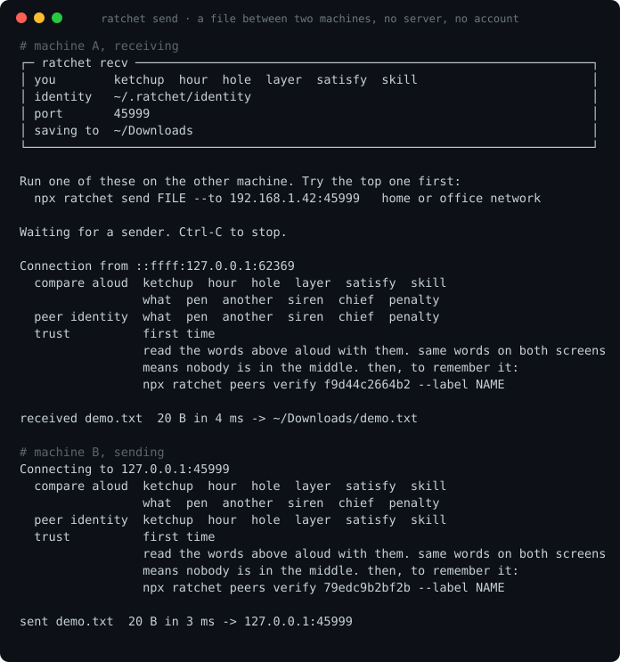
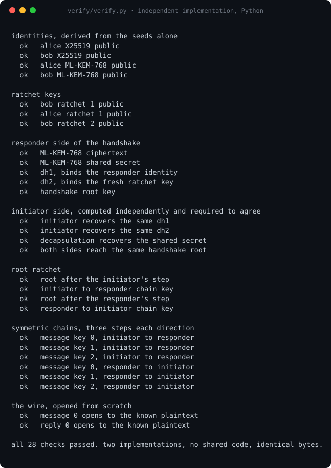
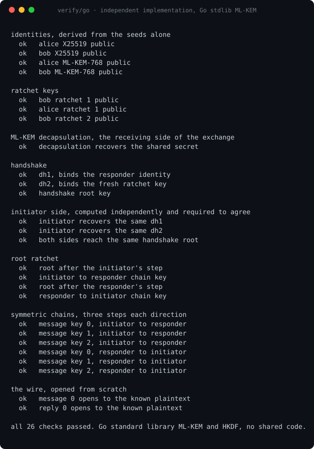
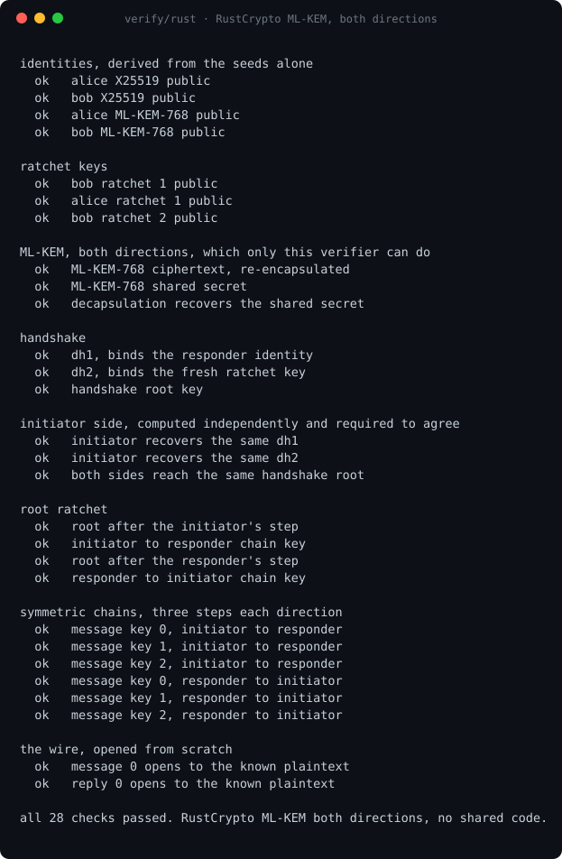
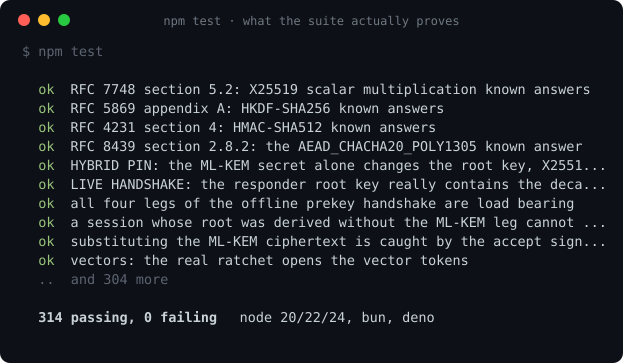
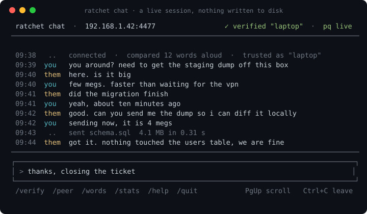
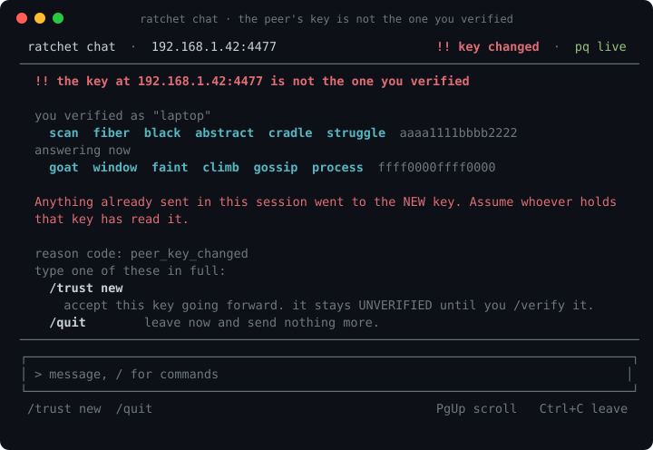

# ratchet-ts

[](https://github.com/gntrs/ratchet-ts/actions/workflows/ci.yml)
[](https://www.npmjs.com/package/ratchet-ts)
[](./LICENSE)
[](https://www.npmjs.com/package/ratchet-ts)

Hybrid X25519 + ML-KEM-768 Double Ratchet in TypeScript. Forward secrecy,
post-compromise security, a post-quantum handshake, and MIT.

> **Not audited.** No independent audit, no formal verification. The primitives
> come from the audited [`@noble`](https://github.com/paulmillr) libraries; the
> protocol on top of them was written by one person. There can be state machine
> bugs no test catches. **If real people's safety depends on it, use
> [libsignal](https://github.com/signalapp/libsignal)** or fund an audit of this.
> Good for learning, prototyping, internal tools, and anywhere MIT is a hard
> requirement and you can accept that gap. On `0.x` the wire format can move.

```sh
npm install ratchet-ts
```

```ts
import { engine, formatFingerprint } from 'ratchet-ts';

const alice = await engine.createIdentity();
const bob = await engine.createIdentity();

// Alice invites, Bob accepts. Tokens are plain strings you can paste anywhere.
const { token, pending } = await engine.invite(alice);
const bobOpen = await engine.open(bob, token, {});          // outcome: 'invite'
const aliceOpen = await engine.open(alice, bobOpen.reply, { pending });

// Both sides show the same six words. Compare them out loud.
console.log(formatFingerprint(bobOpen.peerFingerprint));

const sealed = await engine.seal(aliceOpen.session, 'hello');
const opened = await engine.open(bob, sealed.token, { session: bobOpen.session });
console.log(opened.plaintext);                               // 'hello'
```

`seal` and `open` each return a fresh `session`. Keep the returned one, drop the
old one, never reuse a session across two `seal` calls. Binary payloads go
through `sealBytes` and `openBytes`.

There is a CLI too. Two machines, no account, no server, and six words to read
aloud so you know who is on the other end.



## Don't trust this. Check it.

A crypto library asking to be believed is doing it wrong, so here is everything
you need to not believe this one.

**Check the package matches the source.** Every release from 0.6.1 is published
from GitHub Actions with a Sigstore provenance attestation naming the exact
commit and workflow that built it, countersigned into a public transparency log.

```sh
npm audit signatures
```

**Check the protocol against other implementations.** [SPEC.md](./SPEC.md)
defines the wire format and key schedule completely enough to implement from
scratch without reading `src/`. Three programs did exactly that, in three
languages, against three different sets of primitives. None imports anything
from this repository, and all three run in CI on every push.

`verify/verify.py` uses OpenSSL and a pure Python FIPS 203 library.

```sh
python3 -m venv .venv
.venv/bin/pip install -r verify/requirements.txt
.venv/bin/python verify/verify.py
```



`verify/go` checks the same thing against the **Go standard library's** ML-KEM
and HKDF. Agreeing with a national standard library is a stronger statement than
agreeing with any one package, because nobody picked it to make this repo look
good. Go exposes no deterministic encapsulation, by design, so it verifies key
generation and decapsulation, the receiving side.

```sh
cd verify/go && go run .
```



`verify/rust` uses RustCrypto, and is the only one that covers **both
directions** in one program: it re-encapsulates to reproduce the KEM ciphertext
and then decapsulates that ciphertext back to the same shared secret. Rust is
also the language libsignal is written in, which is the reference at the top of
this README.

```sh
cd verify/rust && cargo run --release
```



**Check the primitives against the standards.** `test/kat-primitives.test.ts`
runs the published vectors from RFC 7748, RFC 5869, RFC 4231 and RFC 8439
against this library's own backend wrappers, not against `@noble` directly.

**Check the post-quantum arm is real.** `test/hybrid.test.ts` and
`test/leg-isolation.test.ts` prove every leg of both handshakes is load bearing
by breaking it. Both were verified by mutation: drop the ML-KEM secret from the
key schedule and seven tests go red.

```sh
git clone https://github.com/gntrs/ratchet-ts && cd ratchet-ts
npm install && npm test
```



## Why this exists

`libsignal` is the reference and it is AGPL, so you cannot use it inside a
closed-source product. The usual next move is to write your own ratchet, which
is how most E2EE breaks. This is the third option.

| Library | License | Post-quantum | Language |
| --- | --- | --- | --- |
| [libsignal](https://github.com/signalapp/libsignal) | AGPL-3.0 | Yes, PQXDH | Rust + bindings |
| [libsignal-protocol-typescript](https://github.com/privacyresearchgroup/libsignal-protocol-typescript) | GPL-3.0 | No | TypeScript |
| [Olm / vodozemac](https://github.com/matrix-org/vodozemac) | Apache-2.0 | No | C++ / Rust |
| **ratchet-ts** | **MIT** | **Yes, ML-KEM-768 hybrid** | **TypeScript** |

## Where it is

Current release **0.6.1**. Runs on Node 20+, Bun, Deno and browsers, all proven
in CI on every push rather than promised here.

| | |
| --- | --- |
| Tests | 314 |
| Overhead per message | 34 bytes on the wire, 67 while a ratchet key rides along |
| Independent verifiers | Python, Go and Rust, all in CI |
| Published with provenance | Yes, from 0.6.1 |

Two machines, because one machine is an anecdote. Medians, with the best run
beside them, since neither box was idle and the best run is the least
contaminated sample rather than the prettiest one.

| | Apple M4, Node 20 | Ryzen 5 7530U, Node 25 |
| --- | --- | --- |
| keygen | 11.75 ms _(best 10.85)_ | not measured |
| handshake | 16.69 ms _(best 15.33)_ | 25.8 ms |
| seal, 256 B | 6 us _(p95 11 us)_ | 16.36 us |
| open, 256 B | 5 us _(p95 10 us)_ | not measured |

The handshake is the expensive one and it is expensive on purpose: it carries
two ML-DSA-65 signatures, which is roughly 29 times the pre-0.6.0 cost. It
happens once per conversation and is still invisible next to a network round
trip. Per message costs are unaffected.

The M4 column is 11 runs. Its handshake spread was 36 percent, which is one
outlier at 21.35 ms on a machine also running a browser and a music player, not
a property of the code. Method, machine variance, and the numbers that turned
out to be wrong are all in [NOTEBOOK.md](./NOTEBOOK.md).

**Done so far**

| | |
| --- | --- |
| 0.2.1 | first working library |
| 0.3.x | binary wire format, native backends, peer trust store, chat client |
| 0.4.0 | header rewrite, 122 bytes of overhead down to 34 |
| 0.5.x | identity and peer list sealed at rest, honest fingerprint comparison |
| 0.6.0 | signed handshake, offline delivery, relay, pairing codes |
| 0.6.1 | provenance on release, leg isolation tests, spec, independent verifier |

## What comes next

In this order, and the reasoning for the order is in [NOTEBOOK.md](./NOTEBOOK.md).

1. **Attachments, and voice notes on top of them.** Needs one new message kind,
   so it is a breaking change and lands with something else that breaks.
2. **One time prekeys**, so offline delivery stops being replayable. 0.6.0 ships
   the bundle and says plainly that a recorded intro frame can be delivered
   twice. Fixing it properly means something hands each prekey out exactly once,
   which means the relay holds state it currently refuses to hold. That trade is
   the real design question and it is not answered yet.
3. **Prekey rotation nobody has to think about.** `publishPrekeys` is cheap and
   meant to run on a schedule. Nothing runs it on a schedule.
4. **A second pair of eyes on the 0.6.0 handshake.** It is new, it is the part
   most worth getting wrong quietly, and one author reviewed it.

**Deliberately not on the list.** Group chat, which is a different protocol
(MLS). A nickname directory, which needs a server that knows who everyone is and
is the thing this avoids. A GUI, which should wait until the protocol stops
moving. And an audit, which is not a roadmap item, it is something you buy, and
it should be bought after the wire format settles.

## Command line

The package ships a `ratchet` binary. Two machines, no account, no setup.

```sh
npm install -g ratchet-ts

ratchet recv --out . --once             # on the receiving machine
ratchet send ./file.zip --to 192.168.1.42   # on the sending machine
ratchet chat --to 192.168.1.42          # live session, nothing saved
ratchet peers                           # who this machine has talked to
ratchet relay                           # your own relay, no default host exists
```

`ratchet chat` is a full screen client. Messages exist in the two terminals and
nowhere else: nothing is written to disk, so there is no history to seize, leak
or subpoena later.



The six words in the header are the peer's fingerprint. You read them aloud once
and the client remembers. **If the key ever changes, you get this instead**, and
it is deliberately not a small yellow banner you can click past:



It names what leaked rather than only what changed, because by the time you see
this the interesting question is what you already sent. It also says plainly
that a peer who reinstalled and a stranger in the middle produce exactly this
screen, since the tool genuinely cannot tell you which one it is.

Full walkthrough, including the `.env` case and what the CLI keeps on disk, is
in [NOTEBOOK.md](./NOTEBOOK.md).

## Documentation

| | |
| --- | --- |
| [SPEC.md](./SPEC.md) | the protocol, complete enough to reimplement from |
| [SECURITY.md](./SECURITY.md) | what is and is not proven, and how to report a bug |
| [CHANGELOG.md](./CHANGELOG.md) | what changed and what the new number is |
| [NOTEBOOK.md](./NOTEBOOK.md) | the long version: benchmarks, method, mistakes |
| [CONTRIBUTING.md](./CONTRIBUTING.md) | how to run the suite and what a PR needs |

## License

MIT. See [LICENSE](./LICENSE).
