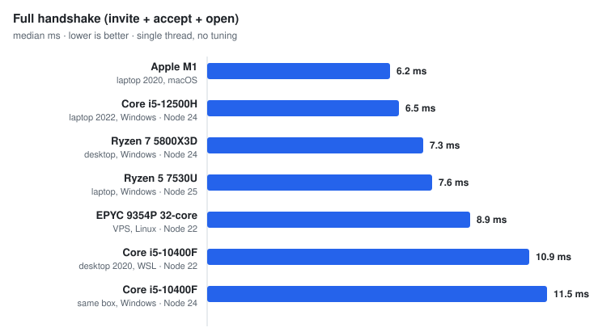
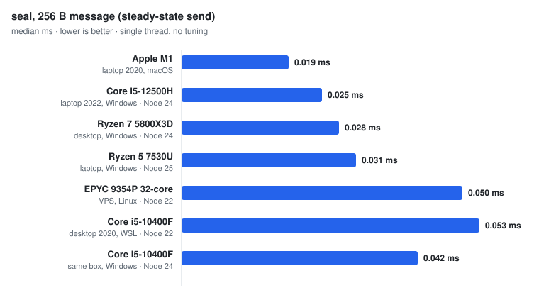

# ratchet-ts

[](https://github.com/gntrs/ratchet-ts/actions/workflows/ci.yml)
[](https://www.npmjs.com/package/ratchet-ts)
[](./LICENSE)
[](./src/index.ts)
[](https://www.npmjs.com/package/ratchet-ts)

Hybrid X25519 + ML-KEM-768 Double Ratchet in TypeScript. MIT.

> **Not audited.** No independent audit, no formal verification. The primitives
> (X25519, ML-KEM-768, HKDF-SHA256, HMAC-SHA256, XChaCha20-Poly1305) come from the
> audited [`@noble`](https://github.com/paulmillr) libraries. The protocol on top
> of them was written and reviewed by one person. There can be state-machine bugs
> no test catches. If real people's safety depends on it, use
> [libsignal](https://github.com/signalapp/libsignal) or fund an audit of this.
> Fine for learning, prototyping, internal tools, and anywhere MIT is a hard
> requirement and you can accept the gap. On 0.x the wire format and API can move.

## Why

`libsignal` is the reference, and it is AGPL/GPL, so you cannot use it inside a
closed-source product. The usual next move is to write your own ratchet, which is
how most E2EE breaks.

This is the third option: MIT, post-quantum, and small enough to read before you
trust it.

| Library | License | Post-quantum | Language |
| --- | --- | --- | --- |
| [libsignal](https://github.com/signalapp/libsignal) | AGPL-3.0 | Yes, PQXDH | Rust + bindings |
| [libsignal-protocol-typescript](https://github.com/privacyresearchgroup/libsignal-protocol-typescript) | GPL-3.0 | No | TypeScript |
| [Olm / vodozemac](https://github.com/matrix-org/vodozemac) | Apache-2.0 | No | C++ / Rust |
| **ratchet-ts** | **MIT** | **Yes, ML-KEM-768 hybrid** | **TypeScript** |

Licenses confirmed against each repo on 2026-07-23. The `ratchet-ts` row is
verifiable here: license in [LICENSE](./LICENSE), the ML-KEM-768 handshake in
[`src/handshake.ts`](./src/handshake.ts).

## Install

```sh
npm install ratchet-ts
```

Runtime deps, all MIT: `@noble/curves`, `@noble/ciphers`, `@noble/hashes`,
`@noble/post-quantum`.

## Quickstart

This is the exact code the smoke test runs against the packed tarball, so it is
proven end to end.

```ts
import assert from 'node:assert/strict';
import { engine, formatFingerprint } from 'ratchet-ts';

const alice = await engine.createIdentity();
const bob = await engine.createIdentity();

// Alice invites, Bob accepts. Tokens are plain strings you can paste anywhere.
const { token: inviteToken, pending } = await engine.invite(alice);

const bobOpen = await engine.open(bob, inviteToken, {});
assert.equal(bobOpen.outcome, 'invite');
let bobSession = bobOpen.session;

const aliceOpen = await engine.open(alice, bobOpen.reply, { pending });
assert.equal(aliceOpen.outcome, 'accepted');
let aliceSession = aliceOpen.session;

// Both sides show the same 6-word fingerprint to verify out of band.
console.log('fingerprint:', formatFingerprint(bobOpen.peerFingerprint));

// Alice -> Bob
const a1 = await engine.seal(aliceSession, 'hello from alice');
aliceSession = a1.session;
const b1 = await engine.open(bob, a1.token, { session: bobSession });
assert.equal(b1.plaintext, 'hello from alice');
bobSession = b1.session;

// Bob -> Alice
const b2 = await engine.seal(bobSession, 'hi back from bob');
bobSession = b2.session;
const a2 = await engine.open(alice, b2.token, { session: aliceSession });
assert.equal(a2.plaintext, 'hi back from bob');
```

`seal` and `open` each return a fresh `session`. The ratchet is immutable at the
API boundary: keep the returned session, drop the old one, never reuse a session
across two `seal` calls.

Want to watch it work first? `node examples/demo.mjs` runs a full handshake, a
message each way, and a tamper that fails closed.

## What it does

- **Forward secrecy.** Every message key is derived once, used once, dropped.
  Stealing the device now does not decrypt old captured messages.
- **Post-compromise security.** One ratchet step from each side after a compromise
  locks the attacker's copied state out.
- **Hybrid post-quantum.** The root key mixes an X25519 result and an ML-KEM-768
  result. The session holds if either one holds. A quantum computer that breaks
  X25519 does not break it, and a flaw in ML-KEM does not break it.
- **Out-of-order and replay-safe.** Late or reordered messages still decrypt,
  skipped keys parked up to a bound. A consumed ciphertext cannot be reopened.
- **Tamper fail-closed.** One flipped bit in the ciphertext, header, or nonce
  fails authentication and returns nothing. Headers are bound in as AAD.

## Protocol

**Handshake** (PQXDH-shaped). The initiator sends an `invite` with its identity
(X25519 + ML-KEM-768 public keys). The responder makes an ephemeral ratchet key,
encapsulates to the initiator's ML-KEM key, mixes two X25519 DH results plus the
ML-KEM shared secret through HKDF-SHA256 into the root key, and replies with an
`accept` (ML-KEM ciphertext + ratchet public key). The initiator decapsulates,
derives the same root key, and takes one DH step. One and a half round trips,
after which the Double Ratchet takes over.

**Double Ratchet.** A DH ratchet turns on every new peer ratchet key, deriving a
new root key and chain. A symmetric ratchet runs each chain forward with
HMAC-SHA256, one unique key per message, none walkable backward. Messages are
sealed with XChaCha20-Poly1305, header bound in as AAD. Skipped keys are kept up
to `MAX_SKIP = 1000` per chain; a larger gap is refused, not allocated.

**Wire format.** Every token is one ASCII string: `OCX1.<kind>.<base64url>`,
`<kind>` in `invite | accept | message`, payload a compact binary body (not JSON)
so it round-trips byte-exact for the AAD binding. Safe to paste into any channel.

<svg viewBox="0 0 640 300" width="100%" role="img" aria-label="Message flow: invite, accept, then ratcheting messages between Alice and Bob" xmlns="http://www.w3.org/2000/svg" style="max-width:640px;font-family:system-ui,-apple-system,sans-serif">
  <defs>
    <marker id="ah" markerWidth="8" markerHeight="8" refX="7" refY="4" orient="auto">
      <path d="M0 0 L8 4 L0 8" fill="none" stroke="currentColor" stroke-width="2" stroke-linecap="round" stroke-linejoin="round"/>
    </marker>
    <marker id="ahg" markerWidth="8" markerHeight="8" refX="7" refY="4" orient="auto">
      <path d="M0 0 L8 4 L0 8" fill="none" stroke="#0f5f44" stroke-width="2" stroke-linecap="round" stroke-linejoin="round"/>
    </marker>
  </defs>
  <text x="120" y="28" text-anchor="middle" font-size="15" font-weight="600" fill="currentColor">Alice</text>
  <text x="520" y="28" text-anchor="middle" font-size="15" font-weight="600" fill="currentColor">Bob</text>
  <line x1="120" y1="44" x2="120" y2="284" stroke="currentColor" stroke-width="2" opacity="0.35"/>
  <line x1="520" y1="44" x2="520" y2="284" stroke="currentColor" stroke-width="2" opacity="0.35"/>
  <line x1="120" y1="80" x2="512" y2="80" stroke="#0f5f44" stroke-width="2" marker-end="url(#ahg)"/>
  <text x="316" y="72" text-anchor="middle" font-size="13" fill="#0f5f44" font-weight="600">invite</text>
  <text x="316" y="96" text-anchor="middle" font-size="11" fill="currentColor" opacity="0.7">identity: X25519 + ML-KEM-768 public</text>
  <line x1="520" y1="140" x2="128" y2="140" stroke="#0f5f44" stroke-width="2" marker-end="url(#ahg)"/>
  <text x="316" y="132" text-anchor="middle" font-size="13" fill="#0f5f44" font-weight="600">accept</text>
  <text x="316" y="156" text-anchor="middle" font-size="11" fill="currentColor" opacity="0.7">ML-KEM ciphertext + ratchet public, root key set</text>
  <line x1="120" y1="204" x2="512" y2="204" stroke="currentColor" stroke-width="2" marker-end="url(#ah)"/>
  <text x="316" y="196" text-anchor="middle" font-size="13" fill="currentColor" font-weight="600">message</text>
  <line x1="520" y1="248" x2="128" y2="248" stroke="currentColor" stroke-width="2" marker-end="url(#ah)"/>
  <text x="316" y="240" text-anchor="middle" font-size="13" fill="currentColor" font-weight="600">message</text>
  <text x="316" y="272" text-anchor="middle" font-size="11" fill="currentColor" opacity="0.7">ratcheting both directions, one key per message</text>
</svg>

## Limits

Read these before trusting it with anything real.

- **No audit.** Repeated on purpose. It is the one that matters.
- **Metadata is visible.** Contents are encrypted and headers are bound, but who
  talks to whom, when, and how much is not hidden. Tokens leak length and kind.
  No traffic-analysis resistance.
- **The ML-KEM contribution is not pinned by a test.** The hybrid mix is in the
  code, but no test yet asserts the ML-KEM half alone changes the root key. Known
  gap.
- **You own identity storage.** This library generates and uses identity keys, it
  does not store them. At-rest handling and rotation are yours. Leaking an identity
  secret is a full compromise of that identity.
- **Fingerprints need out-of-band checking.** The 6-word (66-bit) fingerprint only
  stops impersonation if two people compare it on a channel the attacker does not
  control.

## Tests

Adversarial, not happy-path. Every expected failure asserts a specific reason, so
a wrong error is a failing test.

- **Forward secrecy.** A session snapshot at message N cannot decrypt N+5 once the
  live side ratchets forward.
- **Post-compromise.** Copied old state stops decrypting after the honest side
  re-ratchets.
- **Tamper matrix.** Single-bit flips across ciphertext, header, nonce, and
  truncation all fail closed; malformed and wrong-version tokens map to precise
  reasons instead of throwing raw.
- **Replay.** A consumed ciphertext cannot be reopened.
- **Skip bound.** Skipping past `MAX_SKIP = 1000` is refused with
  `skip_limit_exceeded`, not allocated.

Plus envelope round-trips across all three token kinds, deterministic
fingerprints, out-of-order delivery across ratchet turns, and identity-mismatch
handling. 20 tests.

```sh
npm install && npm test && npm run typecheck && npm run build
```

## Benchmark

```sh
npm run bench
```

Single thread, no tuning. Same bench on four machines so far, medians:

<picture>
  <source media="(prefers-color-scheme: dark)" srcset="bench/charts/handshake-dark.svg">
  
</picture>

<picture>
  <source media="(prefers-color-scheme: dark)" srcset="bench/charts/seal-dark.svg">
  
</picture>

| Machine | Node | Handshake | `seal` 256 B | `open` 256 B |
|---|---|---|---|---|
| Core i5-12500H (laptop 2022) | 24 | 6.5 ms | 0.025 ms | 0.026 ms |
| Ryzen 7 5800X3D (desktop) | 24 | 7.3 ms | 0.028 ms | 0.031 ms |
| Core i5-10400F (desktop 2020, WSL) | 22 | 10.9 ms | 0.053 ms | 0.057 ms |
| Core i5-10400F (same box, Windows) | 24 | 11.5 ms | 0.042 ms | 0.044 ms |
| Ryzen 5 7530U (laptop) | 25 | 13.8 ms | 0.061 ms | 0.065 ms |

The handshake is the expensive step: one ML-KEM-768 encapsulation and decapsulation plus two X25519 exchanges, once per conversation. After that a message is one symmetric ratchet step and one XChaCha20-Poly1305 seal, which is why `seal` and `open` sit under 0.1 ms everywhere. Ciphertext overhead is a constant **+259 bytes per message** (ratchet header + AEAD tag + framing) on every machine, because it is protocol math, not hardware.

The bench is single-core bound, so a newer core beats a bigger machine: the 2022 laptop chip outruns the 5800X3D desktop. The two i5-10400F rows are the same physical box under WSL and under Windows, with different Node versions: the handshake differs by 6 percent, `seal` is 21 percent faster on the Windows run. Treat that as the noise floor between runtimes, not a verdict on either. The test suite has also passed unmodified on hardware I do not own. Charts come from the table via [`bench/charts/generate.mjs`](./bench/charts/generate.mjs); a fixed-iteration CI bench is planned so numbers only move when the code does.

## License

MIT. Copyright (c) 2026 Gintaras. See [LICENSE](./LICENSE).
